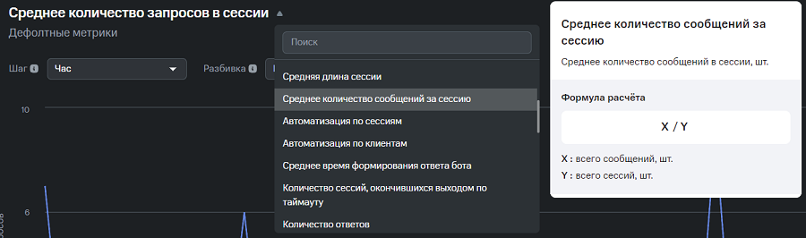
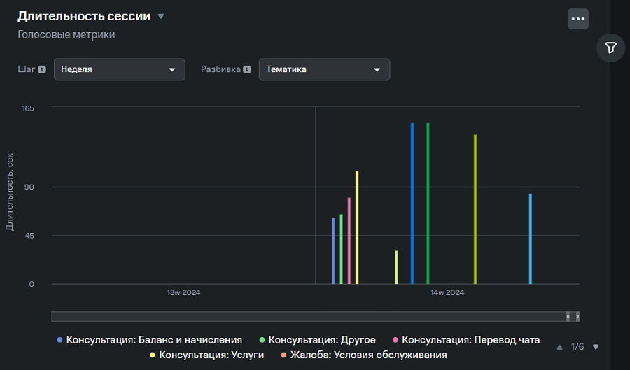
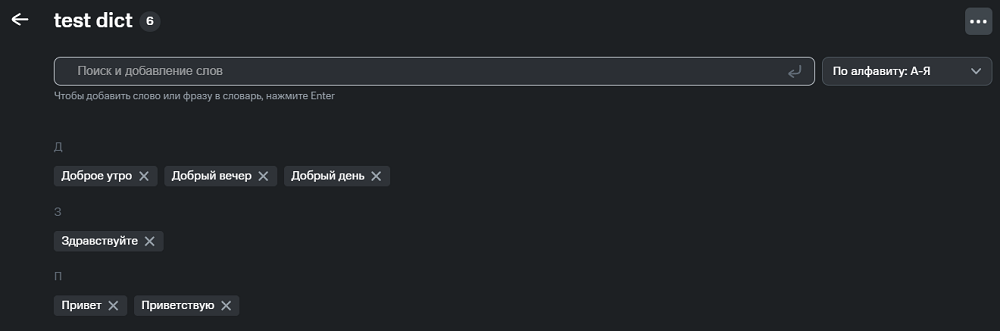

# Руководство пользователя

ПО **WordPulse** используется для просмотра и анализа любого вида коммуникаций с клиентами. Результаты анализа позволяют выработать дальнейшее понимание того, как улучшить работу ботов и / или операторов.

Работа с **WordPulse** осуществляется через веб-клиент. Чтобы посмотреть и проанализировать сессии клиентов, необходимо импортировать логи сессий вручную, либо настроить автоматический импорт из различных систем заказчика.

После добавления логов веб-клиент анализирует их и показывает результаты анализа на соответствующих вкладках.

## Разделы WordPulse

ПО **WordPulse** состоит из двух разделов:

1.  Раздел **Аналитика**, в котором Вы можете:
    - посмотреть содержимое сессий, применить различные фильтры для отображения только интересующих вас сессий во вкладке **Сессии**,
    - посмотреть результаты анализа по различным метрикам во вкладке **Метрики**,
    - посмотреть визуализированные результаты аналитики в динамике во вкладке **Дашборды**,
2.  **Настройка**, в котором Вы можете создать скрипты, словари и теги в соответствующих вкладках для маркирования сессий по заданным условиям.

## Аналитика

### Сессии

Веб-клиент анализирует загруженные логи и отображает все сессии клиентов на вкладке **Сессии**.

На карточке каждой сессии доступны:

- идентификационный номер сессии и поверхность,
- дата в время сессии,
- тональность и тематика общения,
- теги пользователя и др.

Также можно посмотреть параметры каждой реплики: информацию о дате и времени реплики, тональности и добавленных к реплике тегах.

#### Точки перелома тональности реплики

Возле каждой реплики клиента, оператора / бота находится иконка-смайлик, которая показывает тональность реплики. Расчет тональности происходит по голосу и по тексту. Если тональность сообщений клиента изменяет свой характер (например, переходит с позитивного на нейтральный или в негативный) вне зависимости от наличия реплик оператора / бота, то рядом с сообщением отобразится точка перелома в виде иконки-стрелки.

#### Аналитика по NPS

На вкладке **Сессии** пользователь может просматривать метрики удовлетворенности клиентским сервисом, например, tNPS (транзакционный NPS) - оценку конкретного опыта использования сервиса, услуги, товара.

### Применение фильтров

С помощью различных фильтров можно отобразить только те сессии, которые вас интересуют. Вы можете фильтровать сессии, например, по:

- наличию/отсутствию слов и фраз,
- тону общения и точкам перелома тональности,
- по индексу потребительской лояльности,
- по тематике, параметрам сессии,
- количеству реплик участников сессии.

Чтобы каждый раз заново не выбирать нужные параметры для фильтрации, можно создать набор наиболее часто используемых фильтров (сет фильтров).

### Применение многоуровневых фильтров

С помощью многоуровневых фильтров можно формировать выборки сессий с несколькими уровнями детализации и просматривать статистику по ним.

#### Сравнение фильтров

Чтобы найти интересную для дальнейшего анализа лексику, можно воспользоваться сравнением многоуровневых фильтров.

В каждом фильтре отобразятся "Топ слов" или "Топ фраз", количество сессий, в которых эти слова встречаются, и процентное соотношение от общего числа сессий.

#### Экспорт сессий

Проанализированные сессии можно экспортировать в файл формата CSV. Это может понадобиться, если необходимо, например, выгрузить сессии за один день, только с определенным клиентом и / или посмотреть сентимент по сессиям.

### Метрики

Результаты анализа сессий можно посмотреть на вкладке **Метрики**.

Меню над графиком и боковая панель фильтров позволяет менять отображение графика под нужды пользователя.

#### Типы метрик

Анализ проводится по различным метрикам и отображается в виде графика. На текущий момент существует 5 типов метрик:

- **Дефолтная**: позволяет проанализировать сессии по различным параметрам (точный набор доступных метрик зависит от реализации продукта под конкретного заказчика);

- **Сентимент анализ**: анализирует сессии по тону общения, например:
  - **Net sentiment** - разница между сессиями с позитивным и негативным сентиментом,
  - **Доля сессий с переломами**: отношение количества сессий, в которых есть точки перелома, к общему числу сессий.

- **Семантический анализ**: используется для определения ключевых слов и фраз, а также частоты их появления в сессиях.

- **ABSA**: аспектно-ориентированный анализ настроений, позволяющий выделять:
  - **Аспекты**: сущности, отношение к которым оценивает участники сессии,
  - **Оценки**: слова или словосочетания, определяющие отношение к аспекту,
  - **Тональность аспектов**: качественная характеристика оценки аспекта (позитивный, негативный).

- **Голосовая**: позволяет проанализировать сессии с аудиозаписью по различным параметрам.

#### Экспорт графиков

Любой график и облако слов / фраз вкладки **Метрики** можно скачать в формате PNG. Кроме того, все сессии, входящие в графики из раздела дефолтных метрик, сентимент анализа и голосовых метрик, можно скачать в CSV формате.

### Дашборды

Дашборды служат для визуализации результатов аналитики с помощью различных метрик на одном экране. В каждый дашборд можно добавить до четырех графиков для анализа.

## Настройки

## Скрипты

Скрипты описывают то, как будут анализироваться сессии для выполнения конкретной бизнес-задачи.

Скрипт состоит из **Входных условий** и **Правил**.

### Словари

Словари могут использоваться в фильтре поиска, а также при создании условий внутри скрипта, например, условия на содержание в сессии тех или иных элементов из словаря.  

Значения в словаре можно импортировать и экспортировать в формате CSV.

### Теги

Тег – сущность, в которой хранится дополнительная информация о сессии.

Тег может быть связан с сессией или с конкретными фразами внутри неё.

