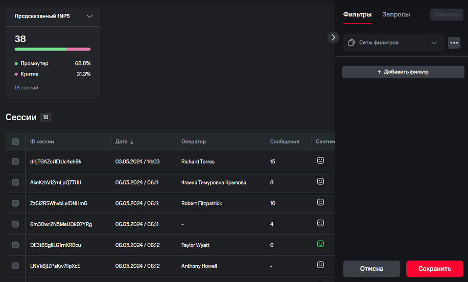
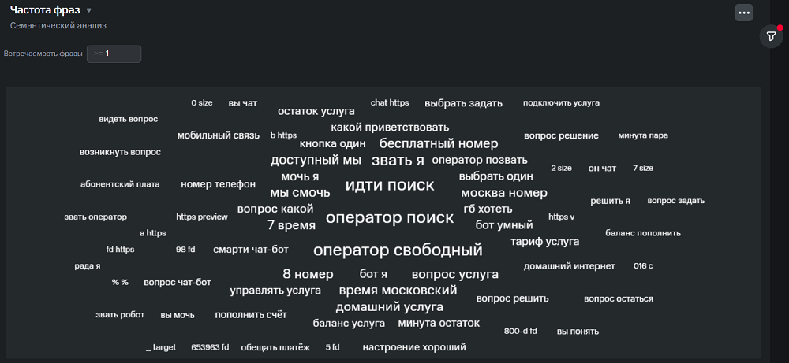
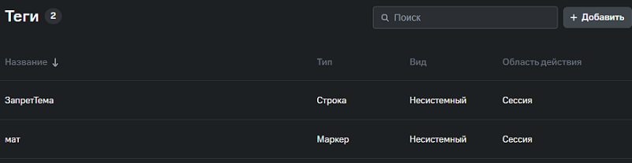
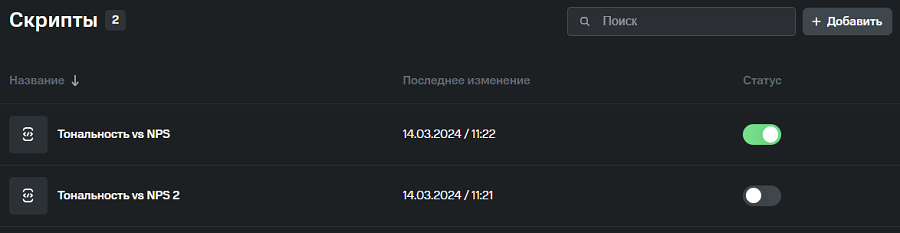

# Руководство пользователя

Аналитика коммуникаций (далее – Модуль **WordPulse**) используется для просмотра и анализа диалогов между клиентами и ботом / оператором.

Результаты анализа позволяют выработать дальнейшее видение и понимание того, как улучшить работу ботов и / или операторов.

Работа с модулем **WordPulse** осуществляется через веб-клиент. Чтобы посмотреть и проанализировать диалоги между пользователем и ботом / оператором, необходимо импортировать логи диалогов согласно соответствующей инструкции.

После добавления логов диалогов, веб-клиент анализирует их и показывает результаты анализа на соответствующих вкладках.

## Разделы модуля WordPulse

Модуль **WordPulse** состоит из двух разделов:

1.  Раздел **Аналитика**, в котором Вы можете:
    - посмотреть содержимое диалогов, применить различные фильтры и запросы для отображения только интересующих вас диалогов во вкладке **Сессии**,
    - посмотреть результаты анализа по различным метрикам во вкладке **Метрики**,
    - посмотреть визуализированные результаты аналитики во вкладке **Дашборды**,
2.  **Настройка**, в котором Вы можете создать словари, теги и скрипты в соответствующих вкладках для маркирования диалогов по заданным условиям.

## Аналитика

### Сессии

Веб-клиент анализирует загруженные логи диалогов и отображает все диалоги между пользователем и ботом / оператором на вкладке **Сессии**.

На карточке каждого диалога доступна следующая информация:

- идентификационный номер сессии и поверхность, а также значок плеера, если у диалога есть аудиозапись.
- смайлик в правом верхнем углу показывает тональность диалога (позитивная / нейтральная / негативная).
- количество реплик в диалоге,
- тематика общения (их может быть несколько),
- теги пользователя,
- в нижнем левом углу отображается ID или имя клиента,
- в нижнем правом углу можно посмотреть дату и время, когда проходило общение.

Чтобы посмотреть все содержимое диалога, нажмите на него левой кнопкой мыши. Справа отобразится панель с информацией о параметрах сессии и добавленных пользователем тегах.

Также можно посмотреть параметры каждой реплики: информацию о дате и времени реплики, тональности и добавленных к реплике тегах.

#### Точки перелома тональности реплики

Возле каждой реплики пользователя, оператора / бота находится иконка-смайлик, которая показывает тональность реплики. Расчет тональности происходит по голосу и по тексту. Если тональность сообщений пользователя изменяет свой характер (например, переходит с позитивного на нейтральный или в негативный) вне зависимости от наличия реплик оператора / бота, то рядом с сообщением отобразится точка перехода в виде иконки-стрелки.

#### Аналитика по tNPS и Net Sentiment

На вкладке **Сессии** пользователь также может просмотреть аналитику по Net sentiment (разница сессий с позитивным и негативным сентиментом, в процентах), Реальному tNPS и Предсказанному tNPS (показатель лояльности пользователей) для текущего списка диалогов.

### Применение фильтров

С помощью различных фильтров можно отобразить только те диалоги, которые вас интересуют. Вы можете фильтровать диалоги, например, по:

- ключевым словам, в том числе с помощью формул,
- результату семантического анализа диалогов по определению ключевых слов и фраз и частоте их появления в диалогах,
- тону общения и точкам перелома тональности,
- кластеру диалога и фраз, который вычисляется с помощью нейромодели,
- результату аспектно-ориентированного анализа настроений (ABSA), который расчитывается с помощью нейромодели-классификатора,
- по индексу потребительской лояльности (tNPS),
- по тематике диалога, который расчитывается с помощью нейромодели-классификатора,
- параметрам сессии,
- количеству реплик участников диалога.

Чтобы каждый раз заново не выбирать нужные параметры для фильтрации, можно создать набор наиболее часто используемых фильтров (сет фильтров).

### Применение многоуровневых запросов

С помощью многоуровневых запросов можно формировать выборки диалогов с несколькими уровнями детализации и просматривать статистику по ним.

Можно создавать запросы трёх уровней: верхнеуровневые запросы и связанные с ними дочерние запросы 2 и 3 уровня.

#### Сравнение запросов

Чтобы найти интересную для дальнейшего анализа лексику, можно воспользоваться сравнением запросов.

В каждом запросе отобразятся "Топ слов" или "Топ фраз", количество диалогов, в которых эти слова встречаются, и процентное соотношение от общего числа диалогов.

### Метрики

Результаты анализа диалогов можно посмотреть на вкладке **Метрики**.

Меню над графиком позволяет выбрать необходимый шаг на оси X. Для каждого шага доступны контрольные точки, при нажатии на которые отобразятся диалоги, вошедшие в основу этой точки на графике. Разбивка позволяет отобразить данные на графике в разрезе выбранных характеристик (например, канал, тональность, кластер и т.д.).

По умолчанию график показывается целиком за весь выбранный временной период. Но также можно настроить, чтобы график отображался частично за определенный интервал этого периода (например, за 10 дней, 5 недель, 2 месяца и т.д.).

#### Типы метрик

Анализ проводится по различным метрикам и отображается в виде графика. На текущий момент существует 5 типов метрик:

- **Дефолтная**: позволяет проанализировать диалоги по различным параметрам;
- **Сентимент анализ**: анализирует диалоги по тону общения;
- **Семантический анализ**: используется для определения ключевых слов и фраз, а также частоты их появления в диалогах;
- **ABSA**: аспектно-ориентированный анализ настроений, позволяющий выделять аспекты, оценки и тональность аспектов;
- **Голосовая**: позволяет проанализировать диалоги с аудиозаписью по различным параметрам.

##### Дефолтный тип метрик

При выборе этого типа, можно посмотреть результаты анализа диалогов по различным метрикам (точный набор доступных метрик зависит от реализации продукта под конкретного заказчика):

##### Тип метрики “Сентимент анализ”

При выборе этого типа можно увидеть следующие метрики:

- **Net sentiment**: разница между сессиями с позитивным и негативным сентиментом, в процентах.

- **Количество сессий с точками перелома**: количество сессий, в которых есть точки перелома - шт. При этом количество точек в одной сессии не имеет значения.  

- **Доля сессий с переломами**: отношение количества диалогов, в которых есть точки перелома, к общему числу диалогов, в процентах.

##### Тип метрики “Семантический анализ“

Тип “Cемантический анализ” включает следующие метрики:

- **Частота слов**: слова отображаются на графике как облако тегов в зависимости от их встречаемости в диалогах. Чем больше встречаемость слов, тем больше размер тегов. Цвет тегов на графике определяется частью речи слова.

- **Частота фраз**: фразы отображаются в зависимости от их встречаемости в диалогах. График частоты фраз – это облако тегов. Размер тегов растет пропорционально встречаемости фразы (чем больше встречаемость, тем больше размер тегов).

При наведении на тег отобразится тултип со значением встречаемости слова, при нажатии на который откроется вкладка **Сессии** с диалогами, в которых встречалось выбранное слово.

##### Тип метрики "ABSA"

Аспектно-ориентированный анализ настроений включает следующие метрики:

- **Аспекты**: сущности, отношение к которым оценивает участники диалога.
- **Оценки**: слова или словосочетания, определяющие отношение к аспекту.
- **Тональность аспектов**: качественная характеристика оценки аспекта (позитивный, негативный).

##### Тип метрики “Голосовая“

При выборе этого типа можно посмотреть результаты анализа диалогов по голосовым метрикам.

#### Экспорт графиков

Любой график и облако слов / фраз вкладки **Метрики** можно скачать в формате PNG. Кроме того, все диалоги, входящие в графики из раздела дефолтных метрик, сентимент анализа и голосовых метрик, можно скачать в CSV формате.

### Дашборды

Дашборды служат для визуализации результатов аналитики с помощью различных метрик на одном экране. В каждый дашборд можно добавить до четырех графиков для анализа.

## Настройки

### Словари

Словари могут использоваться в фильтре поиска, а также при создании условий внутри скрипта, например, условия на содержание в диалоге тех или иных элементов из словаря.  

Значения в словаре можно импортировать и экспортировать в формате CSV.

### Теги

Тег – сущность, в которой хранится дополнительная информация о диалоге.

Тег может быть связан с диалогом или с конкретными фразами внутри него.

## Скрипты

Скрипты описывают то, как будут анализироваться диалоги для выполнения конкретной бизнес-задачи.

Скрипт состоит из **Входных условий** и **Правил**.

